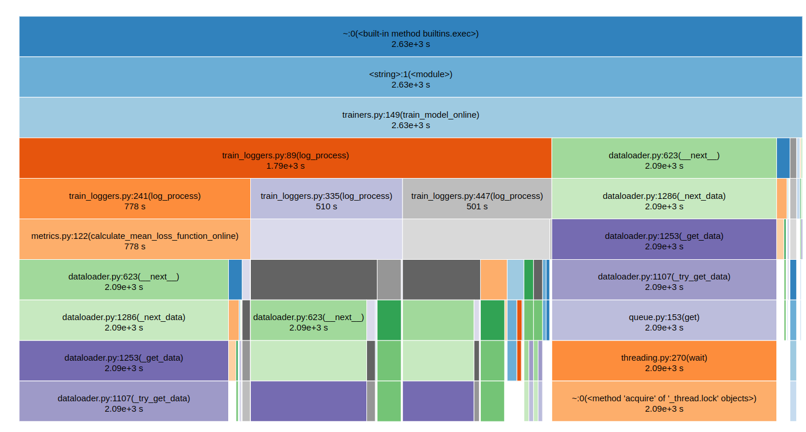
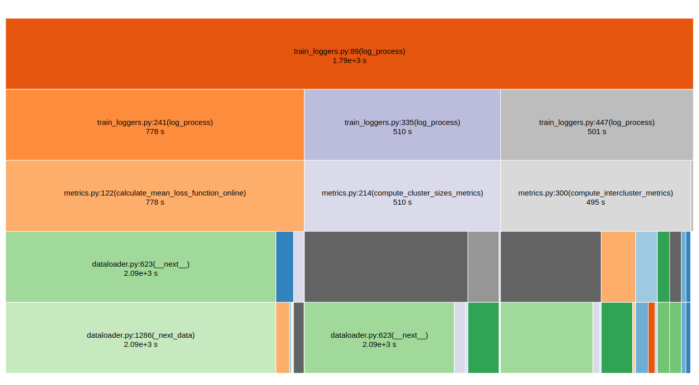

# Profiling results

> Markdown file where we discuss what we learn from the profiling saves

- To explore a profiling save, run `python -m pstats <profiling_save_path>`
- In a more visual way, run `snakeviz <profiling_save_path>`

# First profiling

> Profiling done with lazy data augmentation, `P = 200, K = 2`

- Structure of the saved files:
    - Binary profile stats: `first_profile.stat`
    - Text version, ordered by `cumtime`: `first_profile.txt`
    - Text filtered version: `first_profile_filtered.txt`
        - Contains only entries of our lib code
- Total time: 328.638 seconds
- Most of the time is spent in `dataloader.__next__`. We don't own that implementation, but probably there is performance issues with the lazy data augmentation, or the way we transform the images
- The second part where most of the time is spent is in `Model.forward` where `Model` is the current model we're training, and `loss_functions.forward`
- Conclusions:
    - First, try to use the not lazy evaluated data augmentation, and second try to optimize the loss functions operations (because models are harder to optimize, as they're mostly implemented by pytorch lib)

# Second profiling

> Profiling done with non-lazy data augmentation, `P = 100, K = 2`. Using smaller batch size (P is now half the size), otherwise we ran out of RAM in Google Colab

- Same structure as first profiling, but with name `second_...`
- This time, it tooks 947.719 second to train. Its much more, but it can be because of different P-K values
- Using `snakeviz`, most of the time is spent in `train_loggers`. In the loggers:
    - Most of the time is spent in `compute_intercluster_metrics`. Inside that function, most of the time is spent in `metrics.py:__compute_pairwise_distances`
- Loss function is used a lot, in different places. So optimizing this set of functions might be worth (even though there is a lot of pure pytorch tensor code)

# Experiment

- We run the training with `P = 100, K = 2` with lazy and non-lazy data augmentation, and compare training times
- Note that we don't profile the training, we're only interested in training times
- Non-lazy: 917.8408761024475 seconds
- Lazy: 952.0073399543762 seconds
- **Conclusion**: there is not a big difference (15.29 mins vs 15.86 mins)
    - TODO: we could use a statistical hypothesis test for saying that the difference is not relevant, but might a little too much for this

# Other conclusions

- When using non-lazy data loading, GPU usage a little bit higher

# Pros and cons

| Method   | Pro or Con | Description                                                                                                                                                       |
| :---     | :---       | :---                                                                                                                                                              |
| Lazy     | Pro        | P-K values can be as big as we want, laziness makes low use of RAM                                                                                                |
| Lazy     | Pro        | Every time we access to an augmented item, its created at runtime. So in different epochs we have different images. Thus, more augmentation than with lazy method |
| Lazy     | Pro        | Is not much slower than the non-lazy, thus might seem like the preferred option given the advantages it has                                                       |
| Non-lazy | Con        | P-K values are limited, because big values can cause that we ran out of RAM                                                                                       |
| Non-lazy | Con        | In principle, it should be faster, but its not significantly faster                                                                                               |
| Non-lazy | Pro        | Data augmentation caching can be extended to cache all P-K values, and not just the last P-K value                                                                |

# Perf changes log

> We are going to make some changes to the code in order to have better run times. So first we will write benchmarks for the functions that we are going to change. Then we make some changes and keep track of new benchmarks results and also the total run time for training loop.

- About the two benchmarks we're running:
    - Benchmark entries in the following table are (mean, sd)
    - The benchmarks we're running are defined in `./src/benchmarks/{benchmark_loss_functions, benchmark_metrics}.py`
    - We cannot run `.py` files in *Google Colab*, so we create `.src/benchmarks/Benchmarking notebook.ipynb` to run that `.py` files in a notebook, in *Google Colab*
    - However, we can run the `.py` files using `just benchmarks`
- About the training loop:
    - We use the following parameters:
        - Lazy data augmentation
        - P, K = 100, 2
        - Embedding dimension = 5
        - Training epochs = 1
        - `PROFILE_TRAINING = False`
        - GPU enviroment activated
    - We use the notebook defined in `./src/LFW Notebook.ipynb`. This have some pro's and con's
        - Main pro is that we benchmark with the same pipeline that we use for normal training
        - Main con is that we clutter the training notebook and that we have to run two notebooks each iteration
    - We only have the total time. No repetitions are made, so we don't have mean, sd information

| `compute_intercluster_metrics` | `precompute_pairwise_distances` | Training loop | Change Description                                                                                                                                                                                                                                                                             | Git commit                               |
| :---                           | :---                            | :---          | :---                                                                                                                                                                                                                                                                                           | :---                                     |
| 27.3141, 9.1206                | 39.1880, 0.3676                 | 2341.9525     | No changes made. The project is as we started the process                                                                                                                                                                                                                                      | e7d5342a16d466aff904891168eb6a834561fb2d |
| 16.0072, 2.4126                | 37.0220, 0.5623                 | 939.52497     | No changes made. Just running the same benchmarks a few months after                                                                                                                                                                                                                           | d14c3fb9397e4f2d3c2513d8c6790bba916bb417 |
| 3.2480, 0.9302                 | 12.0495, 0.6669                 | 734.7535      | In `precompute_pairwise_distances`, use cdist to compute the distance matrix in a tensor way. Then convert the tensor to a dict. The last step might slow down computations. Had to change `benchmark_compute_intercluster_metrics`: `nn.Identity -> RandomNet` so the benchmarks run properly | cc8176f3c6add706573ba5627b3801851f009868 |
| 2.5528, 1.6093                 | 12.7482, 1.4838                 | 625.8930      | Use `precompute_pairwise_distances` in Batch Losses. `compute_intracluster_distances` now use precomputations.                                                                                                                                                                                 | 70e4a569660f145f30ac598c3a56f33f747c09a9 |

# Third profiling

- At this point, we have optimized a lot the critical parts of the code, identified in the first two profiles. So now seems reasonable to make a second profile and search for the (potentially new) critical parts of the code
- Parameters used in the profiling:
    - P = 100
    - K = 2
    - Training Epochs = 1
    - Model = LFWResNet
    - Embedding Dimension = 1
    - Hard Batch Triplet Loss
    - Lazy Data Augmentation
- The *Wandb* log can be seen [here]()
- Same file structure as the first two profiles

## Conclusions

> Conclusions after looking at the third profiling data

We can have a global view of the results in the following image:

**Most of the training time is spent in the logging**

The log process view is the following:

The following functions are taking a lot of time (one for each different logger that we are using):

- `calculate_mean_loss_function_online`
    - Most of the time is spent in `dataloader.__next__`
- `compute_cluster_sizes_metrics`
    - Most of the time is spent in `__get_portion_of_dataset_and_embed`, and very little in `compute_intracluster_distances`
    - Then, for `__get_portion_of_dataset_and_embed`, most of the time is spent in `dataloader.__next__`
- `compute_inter_cluster_metrics`
    - Most of the time is spent in `__get_portion_of_dataset_and_embed`, but is not as big portion as in the previous function
    - It is followed by `__compute_pairwise_distances`
        - Most of the time of this function is due to dict comprehension

Now, looking at the filtered file, sorted by `cumtime`, we see:

- Most of the time, after `train_model_online`, is spent in `log_process`, as we knew from the previous exploration
- Followed by `calculate_mean_loss_function_online` and `__get_portion_of_dataset_and_embed`, as we also knew
- Followed by `compute_cluster_sizes_metrics`
- The `dictcomp` in `loss_functions.py:225` takes only 1.526 seconds of `total cumtime`
    - Thus, **we will keep the dict comprehension**
    - The cost is low
    - The abstraction layer that it adds is very helpful
- However, `precompute_pairwise_distances` takes 1.526 seconds of total cumtime. 1.524 seconds come from the dict comprehension

So, next steps could be:

2. Maybe, remove dict comprehension from `__compute_pairwise_distances`.
    - It takes 1.524 seconds out of 1.526 seconds of total cumtime
    - 1.526 seconds of cumtime mean very little in the whole 2632 seconds of training cumtime
